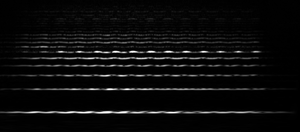

# Constant Q transform
Naive [Constant Q transform](http://academics.wellesley.edu/Physics/brown/pubs/cq1stPaper.pdf) implementation in Haskell. CQT is more suitable for melodic input data than discrete Fourier transform because the transform resolution in lower frequency bands is bigger - in other words the bin frequency/resolution ratio remains constant.



## Running
The code is structured as a Stack package. The build should be easily reproducible by running `stack build` in the root directory.

## Usage

```
Usage: constant-q-exe [OPTIONS]... -i INPUTFILE -o OUTPUTFILE
Process INPUTFILE (in WAV format) and save the Constant Q transform spectrogram to OUTPUTFILE (png image format).
Options:
  -min FREQ Set minimum frequency to FREQ (default 110.0)
  -max FREQ Set maximum frequency to FREQ (default 11000.0)
  -b NUM    Set the number of frequency bins in one octave (default 48)
  -p NUM    Set the hop size (default 1024)
  -q NUM    Set the Q factor (quality of frequency resolution) (default 72)
  -h    Print a help message and exit
```

## Usage example
`stack exec -- constant-q-exe -i input/cello.wav -o doc/cello.png -q 50 -p 200 -min 220`
The output image is shown in the introduction section of the readme.

## Implementation

The input file is read using [`WAVE-0.1.3`](http://hackage.haskell.org/package/WAVE) library, only WAV files are supported. The input samples are sliced up to a list of suffixes with `hop size` gaps. The program then evaluates the CQ transform on these subsets of the input, which is similar to computing discrete Fourier transform (through the direct, naive approach), the results of each of the subset are the pixel columns in the output image. To reduce spectral leak across frequency bins, I used [Hann window](https://en.wikipedia.org/wiki/Window_function#Hann_and_Hamming_windows).

To speed up the computation, repeating computations are cached (see `transformFactorMemoized`). I tried straightforward parallelisation by using the [`parallel`](http://hackage.haskell.org/package/parallel) package but it did not help and in some cases the runtime was actually slower. Unfortunately I don't understand why since the computation of the image columns is mutually independent.